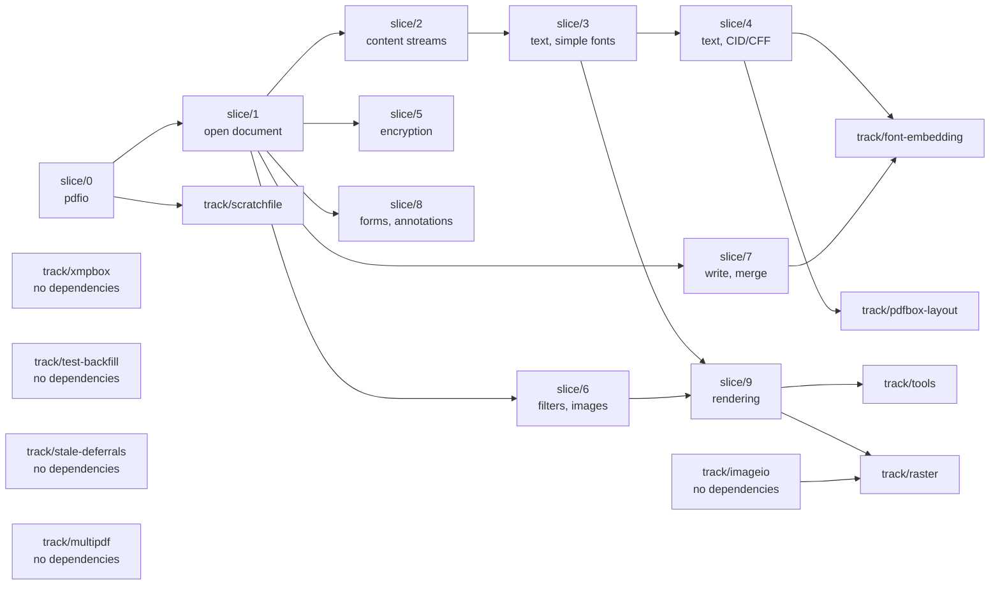
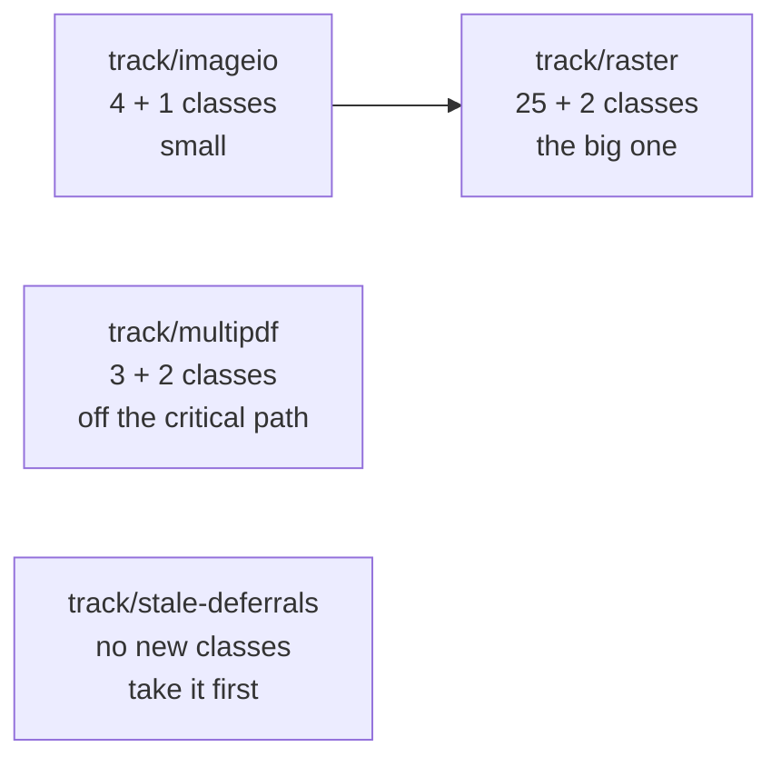

# Migration flow and branch strategy

How the port moves from the Java in this repository to shipped Go, which
branches exist, and what depends on what.

Work units are the capability slices in [`PLAN.md`](PLAN.md). This file is about
how those slices are arranged in git.

## Scope rule — read this first

**This repository has no relationship with Apache PDFBox going forward.**

- **Never** open a pull request against `apache/pdfbox`, or prepare a change for
  contribution upstream.
- **Never** pull, fetch, merge or rebase from `apache/pdfbox`. Do not add it as
  a remote.
- The Java tree here is a **one-time snapshot**. It does not get updated.

The Java is a reference to port *from* and to check the Go *against*, and
nothing else. Apache's later work is out of scope.

This is a deliberate decision, not an oversight. Do not re-introduce upstream
sync tooling, sync procedures, or "keep in step with upstream" reasoning into
these documents.

## Consequences of that rule

Two things follow, and both matter:

**There is no sync procedure, and no drift to check.** The Java never changes,
so a ported Go file can never fall out of step with it. Whatever was true about
the Java when a package was ported stays true.

**Mirroring the Java package layout has lost its main justification.** The
argument for `pdfbox/pdmodel/interchange/logicalstructure` over a Go-shaped
name was "so an upstream fix can be located." There are no upstream fixes. See
the open question in [`PLAN.md`](PLAN.md) — this should be settled before
`slice/1`, because it gets expensive to reverse afterwards.

## Branch roles

| Branch | Role | Notes |
| --- | --- | --- |
| `trunk` | The Java snapshot the port started from | Frozen reference. Nothing is committed here |
| `migration-base` | Port mainline | `trunk` plus everything under `go/`. Always builds, always passes |
| `slice/N-name` | One capability slice from `PLAN.md` | Branched from and merged back to `migration-base` |
| `track/name` | Parallel work with no slice ordering | Same lifecycle as a slice |

`trunk` is kept as a clean copy of the starting point so the Go can be diffed
against the Java it came from. It is frozen — not because anything upstream
would conflict, but because a moving reference is not a reference.

## Ordering between slices (順序関係)



**`slice/1` is the bottleneck, and the only one.** It carries the COS object
model and the parser. Until it lands, nothing else can start; once it lands,
five branches open at once. That has two consequences:

- Do not parallelise `slice/1`. One person, done carefully. The object-model
  decision in `PLAN.md` is made here and everything inherits it.
- Do not start `slice/2` alongside it hoping to save time. It will be rewritten
  when the object model settles.

**After `slice/1`, five branches are genuinely independent:** 2, 5, 6, 7 and 8
touch disjoint packages and can be worked and merged in any order.

`slice/9` is the only one with two parents — it needs text (3) and images (6),
plus the raster backend decision `PLAN.md` says to take before starting.

## Parallel tracks (相互関係なし)

| Track | Depends on | Can start |
| --- | --- | --- |
| `track/xmpbox` | **nothing** | today, in parallel with any slice |
| `track/scratchfile` | `slice/0` | whenever memory pressure matters |
| `track/test-backfill` | **nothing** | today — it ports tests, not classes |
| `track/font-embedding` | `slice/4`, `slice/7` | once both are merged |
| `track/tools` | every slice | once they are all merged |
| `track/pdfbox-layout` | `slice/4`, and a decision | after the text shaper is chosen |
| `track/stale-deferrals` | **nothing** | today, and **first** — it is the only one that can find defects in merged work |
| `track/imageio` | **nothing** | today — `PDImage.Image()` already answers pixels |
| `track/multipdf` | **nothing** | today — slice 7's writer is all it needs |
| `track/raster` | `track/imageio`, for one task of it | today; merge after `track/imageio` |
| `track/java-bug-fixes` | **nothing**, and **last** | once every other branch is merged — see below |

Four of the last five were added once every slice had merged, from a survey that
compared all 891 in-scope Java classes and 237 Java test classes against the Go
tree. They cover what `PLAN.md` counts in scope and no slice claimed. Each has a
file in [`tasks/`](tasks/README.md); the order to take them in is there too, and
the short version is **`track/test-backfill` first**, because it is the only one
that can find defects in work already merged rather than adding more of it.

`PLAN.md` was not changed to add those four. It already counted the work; what
was missing was a branch, and branches are this file's business.

**`track/java-bug-fixes` is different, and `PLAN.md` does say so.** It is not
work `PLAN.md` counted and forgot to assign — it is work the plan's own rules
forbade, right up until the port was finished. A branch that suspends one of
those rules belongs in the document that states them.

`xmpbox` is worth calling out: 74 files, 12.3k lines, and `pdfbox` does not
depend on it — metadata comes back as a raw stream that `xmpbox` parses
separately. It is the one piece of this project with no ordering constraint at
all, so it is the right thing to hand to a second person on day one.

## `track/java-bug-fixes` — the one branch that is not a port

Every branch above ports Java into Go and reproduces its defects on purpose.
`JAVA-BUGS.md` is the record: 84 entries, about seventy of them carried in the
Go deliberately, each with a comment at the site saying so.

**`track/java-bug-fixes` fixes them in the Go.** It is the only branch that
makes the Go behave differently from the reference, and its task file
[`tasks/track-java-bug-fixes.md`](tasks/track-java-bug-fixes.md) is the only
one where the standing rule "never fix a bug that is in the Java" is suspended.
It still changes no Java, and it deletes no entry from `JAVA-BUGS.md`: a fixed
bug is still a bug in the Java, and the entry gains a **Fixed in the Go** line
rather than going away.

**It goes last, and the reason is not caution.** Every branch before it adds
entries to the file it works from, so taking it early means doing it twice. And
while porting is still happening, "the Go does X, is that a defect?" is answered
by reading the Java — an answer that stops working the moment the Go is allowed
to differ on purpose. Finishing the port first keeps that answer cheap for as
long as it is needed.

Its first task is a triage of all 84 entries into fix, keep, not-carried and
test-only, written down in `STATUS.md` before any code moves. Fix is the
default; the four reasons an entry may be kept are enumerated in the task file
and "it looked risky" is not one of them.

## CAUTION — finish the slice

**A slice branch is worked until every file in its scope is ported. Do not
stop partway.**

- Do **not** stop at a natural-looking pause and report progress as if it were a
  result. Four files of twenty-four is not a milestone; it is an unfinished
  branch.
- Do **not** ask whether to continue. The scope is written in
  [`PLAN.md`](PLAN.md). Continuing is the default and needs no confirmation.
- Do **not** treat a partially ported package as deliverable. `STATUS.md`
  records partial state so it stays visible, not so it can be handed over.

If one item in the scope is genuinely blocked — it needs a package from a later
slice, or a decision only the user can make — then port **everything else in the
slice first**, and say plainly at the end what was left and why. Narrowing the
slice is not a decision to take quietly.

The slice ends when its demo in `PLAN.md` runs on a real PDF. Until then the
work is not finished, regardless of how much of it passes.

## Slice lifecycle

```bash
git checkout migration-base && git pull
git checkout -b slice/1-open-document
#  for each package in the slice, in this order:
#    1. port the Java test  -> commit (it does not compile yet)
#    2. port the implementation until it passes -> commit
#    3. refactor to Go idiom, tests green -> commit
#    4. update STATUS.md
cd go && gofmt -l . && go vet ./... && go test ./...
git checkout migration-base && git merge --no-ff slice/1-open-document
```

Committing the ported test separately, before the implementation, is worth the
extra commit: it puts the test-first order in the history where a reviewer can
check it. See [`conventions/tdd.md`](conventions/tdd.md).

`--no-ff` keeps each slice visible as a unit in the history, which matters when
someone later asks what a slice actually contained.

A slice merges when: its demo runs on a real PDF, its ported Java tests pass,
its `STATUS.md` rows are updated, and — from `slice/3` onward — its score
against the 40-document corpus is recorded in the merge message.

## What is not decided here

Whether `migration-base` eventually becomes the default branch, and whether the
Java tree is eventually deleted once the port no longer needs it as a reference.
Both stay open until the port does something useful.

## The last four tracks (残りの四本)

Added once all fifteen earlier branches had merged. **Not from the 891-class
survey** -- that survey missed `multipdf` outright and its subtotals do not add
up to its own headings -- but from the audit that replaced it, which is written
down in [`STATUS.md`](STATUS.md) with the commands to re-run it. The first cut
of this section had three tracks and the audit added a fourth, plus items to
two of the other three.

| Track | Java classes | What it unblocks |
| --- | ---: | --- |
| `track/stale-deferrals` | none -- pieces of merged slices | article beads, `sh` in a written stream, 3 test classes |
| `track/imageio` | `tools/imageio` ×4, `tools/ExtractImages` | `export:images` |
| `track/multipdf` | `multipdf` ×3, `tools/PDFMerger`, `tools/OverlayPDF` | `merge`, `overlay` |
| `track/raster` | `graphics/shading` ×19, `rendering` ×4, `BlendComposite`, `PDPatternContentStream`, `tools/PDFToImage`, `tools/PrintPDF` | `render`, `print`, every deferred pixel comparison |

**Two of the three depend on nothing and can be worked at the same time.** The
ordering was taken from the imports of the five commands that are missing, not
from where the classes sit:

- **`ExtractImages` does not import `rendering`.** It walks the content stream
  with `PDFGraphicsStreamEngine`, which slice 9 ported, and writes what it finds
  with `ImageIOUtil`. The port already decodes an embedded image to pixels —
  `PDImage.Image()` answers a `go image.Image` — so nothing here waits for a
  rasteriser. `track/imageio` is therefore small, independent, and worth taking
  first even though `track/raster` is the branch everyone is waiting for.
- **`PDFMerger` and `OverlayPDF` import only `multipdf`.** No raster, no
  imageio. `track/multipdf` is off the critical path entirely.
- **`PDFToImage` imports both `rendering` and `imageio`.** That single command
  is the only edge between the two branches, and it is the last task of
  `track/raster`, so the two can be worked in parallel as long as
  `track/imageio` merges first.

**The critical path is `track/imageio` → `track/raster`, and nothing else is on
it.** `track/multipdf` and `track/stale-deferrals` run alongside and merge
whenever they are ready.



**`track/stale-deferrals` is not on the critical path and should still be taken
first.** It is the only one of the four that can find a defect in work already
merged; the other three add surface on top of it. That is the argument
`track/test-backfill` was taken on, and this branch exists because the same
argument was not applied a second time: four deferrals in the tree name a
dependency that has since been ported, and one test class was never recorded at
all.

`track/raster` is the last decision this migration has left. `PLAN.md`'s slice 9
section names three ways to take it and slice 9 took the fourth — put the raster
behind an interface and ship everything above it — which is why `rendering.
Backend` exists with no implementation. Choosing one is that branch's A0, and it
is a substitution rather than a port: `java.awt.Graphics2D` has no Go
equivalent, so what the branch writes is measured against the Java's output
rather than translated from its source. `track/pdfbox-layout` is the worked
precedent for how that is done.
