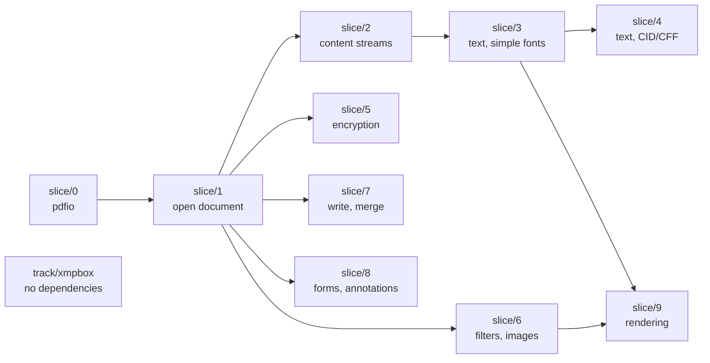

# Migration flow and branch strategy

How the port moves from upstream Java to shipped Go, which branches exist, and
what depends on what.

Work units are the capability slices in [`PLAN.md`](PLAN.md). This file is about
how those slices are arranged in git.

## The one structural fact everything follows from

**The Go port is purely additive.** It lives entirely under `go/`; it does not
touch a single `.java`, `pom.xml` or resource file. So merging upstream Java
changes and doing Go work are operations on disjoint sets of files.

The consequence: **git conflicts between upstream and the port are close to
impossible.** What can go wrong is not textual, it is semantic — upstream
changes a Java file we already ported, and the Go copy silently becomes wrong.
Git will not warn about that. The sync procedure below is what catches it.

## Branch roles

| Branch | Role | Who writes to it |
| --- | --- | --- |
| `trunk` | **Pure upstream mirror.** Apache PDFBox as-is. Never contains Go code | only `git merge upstream/trunk` |
| `migration-base` | **Port mainline.** `trunk` plus everything under `go/` | merges from `trunk` and from slice branches |
| `slice/N-name` | One capability slice from `PLAN.md` | the person porting that slice |
| `track/name` | Parallel work with no slice ordering | whoever picks it up |

Rules that keep this honest:

- **Nothing but upstream ever lands on `trunk`.** It is the reference the port is
  diffed against. The moment it carries local commits, that stops working.
- **Slice branches never merge `trunk` directly.** They take upstream by merging
  `migration-base`, so there is one place where upstream lands and one place
  where it is reviewed.
- **`migration-base` always builds and always passes.** `gofmt -l`, `go vet`,
  `go test` clean before any slice merges in.

## Flow

```
apache/pdfbox ──fetch──▶ trunk ──merge──▶ migration-base ──branch──▶ slice/N
                          ▲                    ▲                        │
                          │                    └────────merge───────────┘
                    (never edited)
```

## Ordering between slices (順序関係)



**`slice/1` is the bottleneck, and the only one.** It carries the COS object
model and the parser. Until it lands, nothing else can start; once it lands,
five branches open at once. That has two consequences:

- Do not parallelise `slice/1`. One person, done carefully. The object-model
  decision in `PLAN.md` is made here and everything inherits it.
- Do not start `slice/2` in parallel with `slice/1` hoping to save time. It will
  be rewritten when the object model settles.

**After `slice/1`, five branches are genuinely independent:** 2, 5, 6, 7 and 8
touch disjoint packages and can be worked and merged in any order.

`slice/9` is the only one with two parents — it needs text (3) and images (6),
plus the raster backend decision that `PLAN.md` says to take before starting.

## Parallel tracks (相互関係なし)

| Track | Depends on | Can start |
| --- | --- | --- |
| `track/xmpbox` | **nothing** | today, in parallel with any slice |
| `track/scratchfile` | `slice/0` | whenever memory pressure matters |

`xmpbox` is worth calling out: 74 files, 12.3k lines, and `pdfbox` does not
depend on it — metadata comes back as a raw stream that `xmpbox` parses
separately. It is the one piece of this project with no ordering constraint at
all, so it is the right thing to hand to a second person on day one.

## Setup, one time

`upstream` is not configured yet — only `origin` (the fork). Add it:

```bash
git remote add upstream https://github.com/apache/pdfbox.git
```

## Syncing upstream

Cadence: whenever upstream cuts a release, or monthly, whichever is sooner.

```bash
git fetch upstream
git checkout trunk && git merge --ff-only upstream/trunk
git checkout migration-base && git merge trunk
```

The merge should be clean — disjoint file sets. If git reports a conflict,
something has written non-upstream commits to `trunk`; fix that rather than
resolving the conflict.

### Then check for semantic drift

This is the step that matters, and the reason the port mirrors the Java package
layout at all. Ask which *already-ported* Java packages changed:

```bash
git diff --stat <last-synced-sha>..trunk -- pdfbox/src/main/java/org/apache/pdfbox/cos
```

Run it for each package whose row in [`STATUS.md`](STATUS.md) is not
`not started`; [`mapping/packages.tsv`](mapping/packages.tsv) gives the Java
path for each Go package. Anything with changes needs the Go side re-read
against the new Java before the sync is called done.

Record the synced commit in the merge message so the next sync knows where to
diff from:

```
merge upstream trunk @ <sha> — checked cos, pdfparser, pdfio for drift
```

## Slice lifecycle

```bash
git checkout migration-base && git pull
git checkout -b slice/1-open-document
#  for each package in the slice, in this order:
#    1. port the Java test  -> commit (it does not compile yet)
#    2. port the implementation until it passes -> commit
#    3. refactor to Go idiom, tests green -> commit
#    4. update STATUS.md
cd go && gofmt -l . && go vet ./... && go test ./...
git checkout migration-base && git merge --no-ff slice/1-open-document
```

Committing the ported test separately, before the implementation, is worth the
extra commit: it puts the test-first order in the history where a reviewer can
check it. See [`conventions/tdd.md`](conventions/tdd.md).

`--no-ff` keeps each slice visible as a unit in the history, which matters when
someone later asks what a slice actually contained.

A slice merges when: its demo runs on a real PDF, its ported Java tests pass,
its `STATUS.md` rows are updated, and — from `slice/3` onward — its score
against the 40-document corpus is recorded in the merge message.

## What is not decided here

Whether `migration-base` eventually becomes the default branch, or the Go port
moves to a repository of its own. Both stay open until the port does something
useful; splitting the repo would end the ability to diff against `trunk`, which
is currently the main reason for the layout choices in
[`conventions/prior-art.md`](conventions/prior-art.md).
