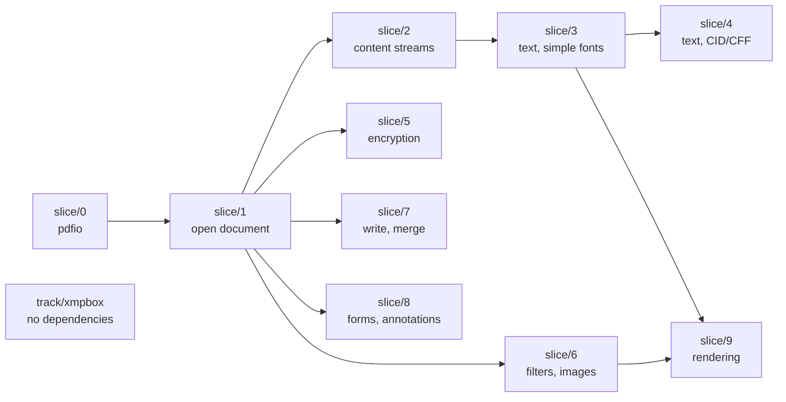

# Migration flow and branch strategy

How the port moves from the Java in this repository to shipped Go, which
branches exist, and what depends on what.

Work units are the capability slices in [`PLAN.md`](PLAN.md). This file is about
how those slices are arranged in git.

## Scope rule — read this first

**This repository has no relationship with Apache PDFBox going forward.**

- **Never** open a pull request against `apache/pdfbox`, or prepare a change for
  contribution upstream.
- **Never** pull, fetch, merge or rebase from `apache/pdfbox`. Do not add it as
  a remote.
- The Java tree here is a **one-time snapshot**. It does not get updated.

The Java is a reference to port *from* and to check the Go *against*, and
nothing else. Apache's later work is out of scope.

This is a deliberate decision, not an oversight. Do not re-introduce upstream
sync tooling, sync procedures, or "keep in step with upstream" reasoning into
these documents.

## Consequences of that rule

Two things follow, and both matter:

**There is no sync procedure, and no drift to check.** The Java never changes,
so a ported Go file can never fall out of step with it. Whatever was true about
the Java when a package was ported stays true.

**Mirroring the Java package layout has lost its main justification.** The
argument for `pdfbox/pdmodel/interchange/logicalstructure` over a Go-shaped
name was "so an upstream fix can be located." There are no upstream fixes. See
the open question in [`PLAN.md`](PLAN.md) — this should be settled before
`slice/1`, because it gets expensive to reverse afterwards.

## Branch roles

| Branch | Role | Notes |
| --- | --- | --- |
| `trunk` | The Java snapshot the port started from | Frozen reference. Nothing is committed here |
| `migration-base` | Port mainline | `trunk` plus everything under `go/`. Always builds, always passes |
| `slice/N-name` | One capability slice from `PLAN.md` | Branched from and merged back to `migration-base` |
| `track/name` | Parallel work with no slice ordering | Same lifecycle as a slice |

`trunk` is kept as a clean copy of the starting point so the Go can be diffed
against the Java it came from. It is frozen — not because anything upstream
would conflict, but because a moving reference is not a reference.

## Ordering between slices (順序関係)



**`slice/1` is the bottleneck, and the only one.** It carries the COS object
model and the parser. Until it lands, nothing else can start; once it lands,
five branches open at once. That has two consequences:

- Do not parallelise `slice/1`. One person, done carefully. The object-model
  decision in `PLAN.md` is made here and everything inherits it.
- Do not start `slice/2` alongside it hoping to save time. It will be rewritten
  when the object model settles.

**After `slice/1`, five branches are genuinely independent:** 2, 5, 6, 7 and 8
touch disjoint packages and can be worked and merged in any order.

`slice/9` is the only one with two parents — it needs text (3) and images (6),
plus the raster backend decision `PLAN.md` says to take before starting.

## Parallel tracks (相互関係なし)

| Track | Depends on | Can start |
| --- | --- | --- |
| `track/xmpbox` | **nothing** | today, in parallel with any slice |
| `track/scratchfile` | `slice/0` | whenever memory pressure matters |

`xmpbox` is worth calling out: 74 files, 12.3k lines, and `pdfbox` does not
depend on it — metadata comes back as a raw stream that `xmpbox` parses
separately. It is the one piece of this project with no ordering constraint at
all, so it is the right thing to hand to a second person on day one.

## Slice lifecycle

```bash
git checkout migration-base && git pull
git checkout -b slice/1-open-document
#  for each package in the slice, in this order:
#    1. port the Java test  -> commit (it does not compile yet)
#    2. port the implementation until it passes -> commit
#    3. refactor to Go idiom, tests green -> commit
#    4. update STATUS.md
cd go && gofmt -l . && go vet ./... && go test ./...
git checkout migration-base && git merge --no-ff slice/1-open-document
```

Committing the ported test separately, before the implementation, is worth the
extra commit: it puts the test-first order in the history where a reviewer can
check it. See [`conventions/tdd.md`](conventions/tdd.md).

`--no-ff` keeps each slice visible as a unit in the history, which matters when
someone later asks what a slice actually contained.

A slice merges when: its demo runs on a real PDF, its ported Java tests pass,
its `STATUS.md` rows are updated, and — from `slice/3` onward — its score
against the 40-document corpus is recorded in the merge message.

## What is not decided here

Whether `migration-base` eventually becomes the default branch, and whether the
Java tree is eventually deleted once the port no longer needs it as a reference.
Both stay open until the port does something useful.
