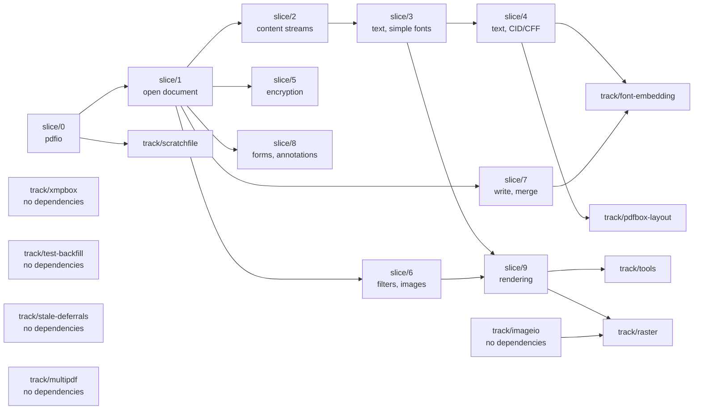

# Migration flow and branch strategy

How the port moved from the Java in this repository to shipped Go, which
branches exist, and what depended on what.

Work units are the capability slices in [`PLAN.md`](PLAN.md). This file is about
how those slices were arranged in git. Every branch named below is merged;
[`tasks/README.md`](tasks/README.md) is the index and carries each one's state.

## Scope rule — read this first

**This repository has no relationship with Apache PDFBox going forward.**

- **Never** open a pull request against `apache/pdfbox`, or prepare a change for
  contribution upstream.
- **Never** pull, fetch, merge or rebase from `apache/pdfbox`. Do not add it as
  a remote.
- The Java tree here is a **snapshot**. It does not get updated.

The Java is a reference to port *from* and to check the Go *against*, and
nothing else. Apache's later work is out of scope.

This is a deliberate decision, not an oversight. Do not re-introduce upstream
sync tooling, sync procedures, or "keep in step with upstream" reasoning into
these documents.

## Consequences of that rule

Two things follow, and both matter:

**There is no sync procedure, and no drift to check.** A ported Go file cannot
fall out of step with Java that does not move. This held once, and then did not:
the merge `3d024173c` of 2026-09-07 brought 25 Apache commits into
`migration-base` and moved 16 Java files under the port. `track/upstream-sync`
is the record of what that cost — which `JAVA-BUGS.md` entries it closed, and
which five sites left the Go behind the new reference. Its task file,
[`tasks/track-upstream-sync.md`](tasks/track-upstream-sync.md), has the ten
in-scope files one by one. The rule above is what stands now.

**Mirroring the Java package layout has lost its main justification.** The
argument for `pdfbox/pdmodel/interchange/logicalstructure` over a Go-shaped
name was "so an upstream fix can be located." There are no upstream fixes.
`slice/1` kept the mirrored layout anyway, and [`PLAN.md`](PLAN.md)'s slice 1
section records what it settled on and where the Go says so.

## Branch roles

| Branch | Role | Notes |
| --- | --- | --- |
| `trunk` | The Java snapshot the port started from | Frozen reference. Nothing is committed here |
| `migration-base` | Port mainline | `trunk` plus everything under `go/`. Always builds, always passes |
| `slice/N-name` | One capability slice from `PLAN.md` | Branched from and merged back to `migration-base` |
| `track/name` | Parallel work with no slice ordering | Same lifecycle as a slice |

`trunk` is kept as a clean copy of the starting point so the Go can be diffed
against the Java it came from. It is frozen — not because anything upstream
would conflict, but because a moving reference is not a reference.

## Ordering between slices (順序関係)



**`slice/1` was the bottleneck, and the only one.** It carries the COS object
model and the parser. Until it landed nothing else could start; once it landed,
five branches opened at once. That had two consequences:

- It was not parallelised. One person, done carefully, because the object-model
  decision in `PLAN.md` is made here and everything inherits it.
- `slice/2` was not started alongside it to save time. It would have been
  rewritten when the object model settled.

**After `slice/1`, five branches were genuinely independent:** 2, 5, 6, 7 and 8
touch disjoint packages and could be worked and merged in any order.

`slice/9` is the only one with two parents — it needed text (3) and images (6),
plus the raster backend question, which `PLAN.md`'s slice 9 section settles.

## Parallel tracks (相互関係なし)

| Track | Depends on | Could start |
| --- | --- | --- |
| `track/xmpbox` | **nothing** | any time, in parallel with any slice |
| `track/scratchfile` | `slice/0` | whenever memory pressure matters |
| `track/test-backfill` | **nothing** | any time — it ports tests, not classes |
| `track/font-embedding` | `slice/4`, `slice/7` | once both are merged |
| `track/tools` | every slice | once they are all merged |
| `track/pdfbox-layout` | `slice/4`, and a decision | after the text shaper is chosen |
| `track/stale-deferrals` | **nothing** | any time, and **first** — see below |
| `track/imageio` | **nothing** | any time — `PDImage.Image()` already answers pixels |
| `track/multipdf` | **nothing** | any time — slice 7's writer is all it needs |
| `track/raster` | `track/imageio`, for one task of it | any time; merge after `track/imageio` |
| `track/java-bug-fixes` | **nothing**, and **last** | once every other branch is merged — see below |

Four of the last five were added once every slice had merged, from a survey that
compared every in-scope Java class and test class against the Go tree;
[`STATUS.md`](STATUS.md) carries that survey and its counts. They cover what
`PLAN.md` counts in scope and no slice claimed, and each has a file in
[`tasks/`](tasks/README.md).

**A branch that can find defects in merged work goes before one that adds more
of it.** That is the whole of the ordering argument for the two marked
**first** above — `track/test-backfill` among the earlier ones,
`track/stale-deferrals` among the last four — and neither is on anything else's
critical path.

`PLAN.md` was not changed to add those four. It already counted the work; what
was missing was a branch, and branches are this file's business.
`track/java-bug-fixes` is the exception: it is not work `PLAN.md` counted and
forgot to assign, but work the plan's own rules forbade until the port was
finished, and a branch that suspends one of those rules belongs in the document
that states them.

`xmpbox` is worth calling out: nothing in the build depends on it — see
[`mapping/modules.md`](mapping/modules.md) — so it is the one piece of this
project with no ordering constraint at all, and the right thing to hand to a
second person on day one.

## `track/java-bug-fixes` — the one branch that is not a port

Every branch above ports Java into Go and reproduces its defects on purpose.
`JAVA-BUGS.md` is the record, and it carries the counts: while the port ran,
every entry was carried in the Go deliberately, with a comment at the site
saying so.

**`track/java-bug-fixes` fixed them in the Go**, and is merged. It is the only
branch that makes the Go behave differently from the reference, and its task
file [`tasks/track-java-bug-fixes.md`](tasks/track-java-bug-fixes.md) is the
only one where the standing rule "never fix a bug that is in the Java" is
suspended. It still changes no Java, and it deletes no entry from
`JAVA-BUGS.md`: a fixed bug is still a bug in the Java, and the entry gains a
**Fixed in the Go** line rather than going away.

**It goes last, and the reason is not caution.** Every branch before it adds
entries to the file it works from, so taking it early means doing it twice. And
while porting is still happening, "the Go does X, is that a defect?" is answered
by reading the Java — an answer that stops working the moment the Go is allowed
to differ on purpose. Finishing the port first keeps that answer cheap for as
long as it is needed.

Its first task is a triage of every entry into fix, keep, not-carried and
test-only, written down in `STATUS.md` before any code moves. Fix is the
default; the four reasons an entry may be kept are enumerated in the task file
and "it looked risky" is not one of them.

## CAUTION — finish the slice

**A slice branch is worked until every file in its scope is ported. Do not stop
partway**, and do not ask whether to continue — the scope is written in
[`PLAN.md`](PLAN.md). The rule in full, with the phases it applies to, is in
[`tasks/TEMPLATE.md`](tasks/TEMPLATE.md), which every branch file copies.

If one item in the scope is genuinely blocked — it needs a package from a later
slice, or a decision only the user can make — then port **everything else in the
slice first**, and say plainly at the end what was left and why. Narrowing the
slice is not a decision to take quietly. How much of the slice passes is not the
test of whether it is finished; `PLAN.md`'s definition of done is.

## Slice lifecycle

```bash
git checkout migration-base && git pull
git checkout -b slice/1-open-document
#  for each package in the slice, in this order:
#    1. port the Java test  -> commit (it does not compile yet)
#    2. port the implementation until it passes -> commit
#    3. refactor to Go idiom, tests green -> commit
#    4. update STATUS.md
cd go && gofmt -l . && go vet ./... && go test ./...
git checkout migration-base && git merge --no-ff slice/1-open-document
```

Committing the ported test separately, before the implementation, is worth the
extra commit: it puts the test-first order in the history where a reviewer can
check it. See [`conventions/tdd.md`](conventions/tdd.md).

`--no-ff` keeps each slice visible as a unit in the history, which matters when
someone later asks what a slice actually contained.

A slice merges when: its demo runs on a real PDF, its ported Java tests pass,
its `STATUS.md` rows are updated, and — from `slice/3` onward — its score
against the text-extraction corpus is recorded in the merge message.

## What is not decided here

Whether `migration-base` eventually becomes the default branch, and whether the
Java tree is eventually deleted once the port no longer needs it as a reference.
Both were left open until the port did something useful. It does; `trunk` is
still the default branch and the Java tree is still in place, so both are still
open and are now the user's to take.

## The last four tracks (残りの四本)

Added once all fifteen earlier branches had merged. **Not from the 891-class
survey** -- that survey missed `multipdf` outright and its subtotals do not add
up to its own headings -- but from the audit that replaced it, which is written
down in [`STATUS.md`](STATUS.md) with the commands to re-run it.

| Track | Java classes | What it unblocked |
| --- | ---: | --- |
| `track/stale-deferrals` | none -- pieces of merged slices | article beads, `sh` in a written stream, 3 test classes |
| `track/imageio` | `tools/imageio` ×4, `tools/ExtractImages` | `export:images` |
| `track/multipdf` | `multipdf` ×3, `tools/PDFMerger`, `tools/OverlayPDF` | `merge`, `overlay` |
| `track/raster` | `graphics/shading` ×19, `rendering` ×4, `BlendComposite`, `PDPatternContentStream`, `tools/PDFToImage`, `tools/PrintPDF` | `render`, every deferred pixel comparison |

The ordering was taken from the imports of the five commands that were missing,
not from where the classes sit:

- **`ExtractImages` does not import `rendering`.** It walks the content stream
  with `PDFGraphicsStreamEngine`, which slice 9 ported, and writes what it finds
  with `ImageIOUtil`. The port already decodes an embedded image to pixels —
  `PDImage.Image()` answers a `go image.Image` — so nothing there waited for a
  rasteriser. `track/imageio` was therefore small, independent, and worth taking
  first even though `track/raster` was the branch everyone was waiting for.
- **`PDFMerger` and `OverlayPDF` import only `multipdf`.** No raster, no
  imageio. `track/multipdf` was off the critical path entirely.
- **`PDFToImage` imports both `rendering` and `imageio`.** That single command
  is the only edge between the two branches, and it was the last task of
  `track/raster`, so the two could be worked in parallel as long as
  `track/imageio` merged first.

**The critical path was `track/imageio` → `track/raster`, and nothing else was
on it.** `track/multipdf` and `track/stale-deferrals` ran alongside, and
`track/stale-deferrals` went first under the rule above. It exists because that
rule was not applied a second time after `track/test-backfill`: four deferrals
in the tree named a dependency that had since been ported, and one test class
was never recorded at all.

`track/raster` carried the last decision this migration had left. `PLAN.md`'s
slice 9 section names three ways to take it and slice 9 took the fourth — put
the raster behind an interface and ship everything above it — which is why
`rendering.Backend` existed with no implementation. Choosing one was that
branch's A0, and it was a substitution rather than a port:
`java.awt.Graphics2D` has no Go equivalent, so what the branch wrote is measured
against the Java's output rather than translated from its source.
`track/pdfbox-layout` is the worked precedent for how that is done. What it
chose, and what stays unported by name because of it, is in `PLAN.md`'s slice 9
section and in [`STATUS.md`](STATUS.md).

`tools/PrintPDF` is what the table above lists for `track/raster` and that
branch did not build: it waits on a printing system, not on a rasteriser. See
`PLAN.md`, "What is left".
